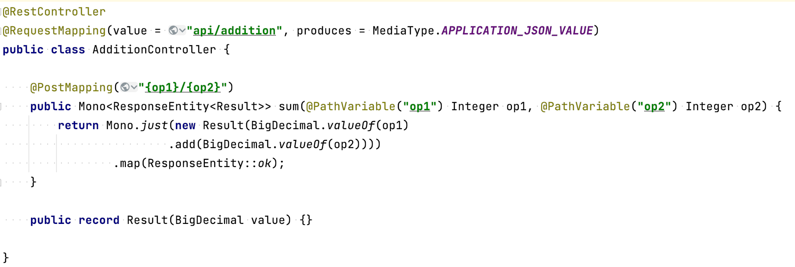
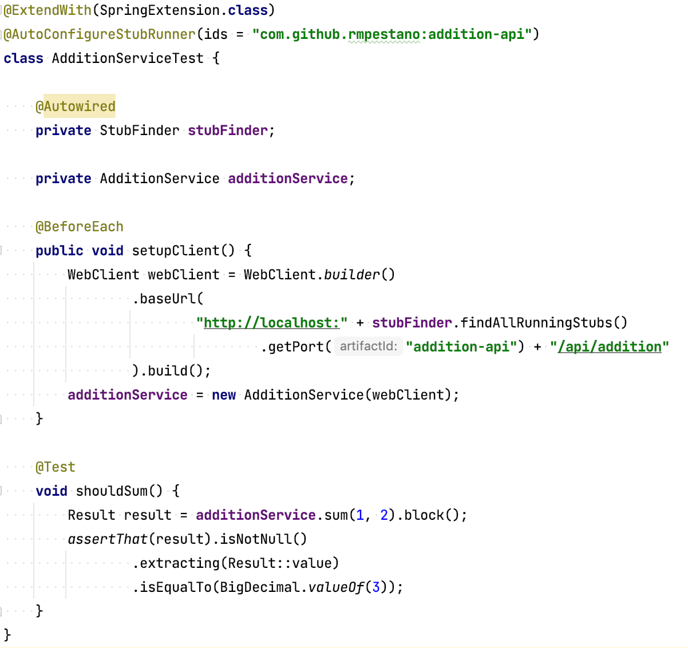

= Spring Cloud contracts example

image:https://github.com/rmpestano/rest-api-contracts/actions/workflows/ci.yml/badge.svg[Build Status, link=https://github.com/rmpestano/rest-api-contracts/actions/workflows/ci.yml]

A sample application to demo https://spring.io/projects/spring-cloud-contract[Spring cloud contract]. 

The code in this repo is used in https://rpestano.wordpress.com/2021/12/28/ensuring-rest-api-compatibility-with-spring-cloud-contract/[this blog post^].

This repository contains a https://github.com/rmpestano/rest-api-contracts/tree/master/addition-api/[producer API] and a https://github.com/rmpestano/rest-api-contracts/tree/master/calculator-api[consumer API].

`Addition API` just sums 2 numbers:

`Calculator API` is the client of Addition API and uses `contract tests` to verify API changes *at build time*:

== Running

The only prerequisite is `jdk 17` installed.

`./mvnw package` on `rest-api-contracts` parent module should run contract tests defined in Calculator API.

